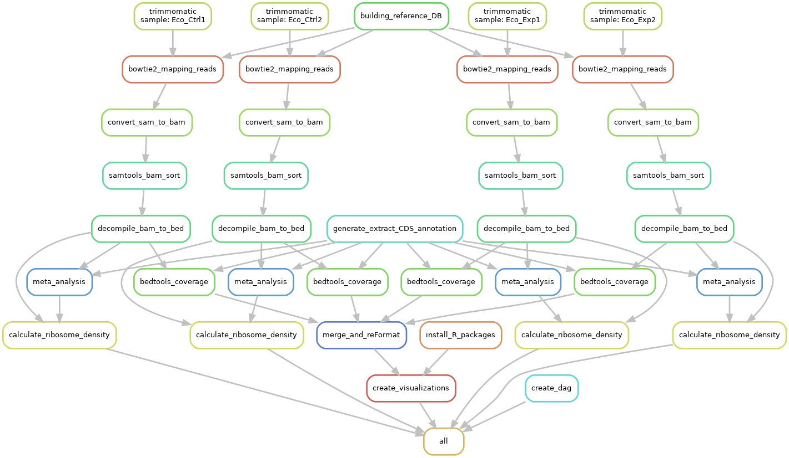

--------------------------------------------------------------------------------

# Dataprocessing final assignement 
Repository for the Dataprocessing course (2022-2023) final assignment.

--------------------------------------------------------------------------------
## About the repository
This repository is about the Dataprocessing course final assignment, This assignment is to re-create a high-performance bioinformatic data analysis workflow. 

The aritcle is about a simple analysis pipeline for Ribo-Seq data in bacteria, 
so-called simple translatome analysis tool for Ribo-Seq (STATR). STATR can be
used to carry out the primary processing of Ribo-Seq data,subsequently allowing 
for multiple levels of translatome study, from experimental validation to in-depth analyse.

The article can be found here:[Link to article](https://link.springer.com/article/10.1007/s12275-020-9536-2) 
The full article is downloadable from the link.

--------------------------------------------------------------------------------

## Contents
This repository has directories with file and data and supporting files

|Directories       |Contains                                              |
|---               |---                                                   |
|Config            |Configuration file                                    |
|Data              |Raw reads and genome(annotation)                      |
|Images            |workflow visualization                                |
|Scripts           |Python and R scripts                                  |
|Software          |installation dir for software + install shell scripts |
|Workflow          |Snakefile + rules directory                           |

|Files             |Contains                                              |
|---               |---                                                   |
|Requirements.txt  |File for loading python packages in venv              |
|LICENSE           |License for usage and distribution of software        |
|.gitignore        |For ignoring python, R, venv and snakemake junk files |

--------------------------------------------------------------------------------

## Requirements

This project is run on a **Unix-based system** (LInux/macOS), users on a Windows system cannot use this project due project packages that are not available for Windows.

There are two programming languages that are used in this project:

- Python v3.9.2
- R v4.0.4

you can check the current version of Python/R by running:

```bash
<python/R> --version
```

Newer versions of Python and/or R are also acceptable. 
Pip is the package-management system for Python and is used to install and manage software packages in this project. The version that is used: 

- pip v23.0.1 

Make sure that the requirements are met before proceeding to the software installation.

--------------------------------------------------------------------------------
## Software installation 

This project uses a couple of tools and software, with is listed below + installation guide:

- Snakemake v6.15.5
- Trimmomatic v0.39
- Bowtie2 2.4.2
- Samtools 1.11
- Bedtools 2.30

Most of the software is installed on the BIN network by default, check this by using:

```bash
<software_tools> --version
```
If it gives output with a version number, then it is installed already. If it is not installed or the version is to low, follow the installation instructions of the relevant software. 

The given paths below expects that you are at the project root folder. 

### Installing Snakemake

This project uses mainly the workflow tool *Snakemake*. Snakemake is a tool used in bioinformatics and data science to create and manage computational workflows. A workflow is a series of steps or processes that need to be performed in a specific order to obtain a result. Snakemake allows you to define these steps as rules in a file, along with their inputs and outputs, and then automatically executes them in the correct order to produce the desired output.

To use the project + tools effective, a Virtual environment (venv) is desired. To create a venv, open a terminal and make sure that the working directory is the root of this repository and execute the following command:

```bash
Python3 -m venv path/to/new/venv
```

A venv is now created, Run the following command to activate the venv:

```bash
Source path/to/new/venv/bin/activate
```

With a secure and protected environment active, run the next command to install all the packages for this project, including snakemake:

```bash
pip install -r requirements.txt
```

This completes the installation of all packages + snakemake, to verify use the command:

```bash
snakemake --version
```

This should give a output of 6.15.5, or otherwise an error if installation was not correct.
For installation help if necessary: [Snakemake installation](https://snakemake.readthedocs.io/en/stable/getting_started/installation.html)

### Intalling Trimmomatic

Trimmomatic is the main tool for trimming the raw reads. It trims the low quality reads and removes the adapter sequences. 

To install Trimmomatic use the shell script at software/installation_scripts/Trimmomatic_install.sh:

```shell
software/installation_scripts/Trimmomatic_install.sh
```

This shell script downloads, unzip at location and remove the junk files of Trimmomatic. Make sure that the shell script is executable before use.
The new installed Trimmomatic folder should be installed under the software directory.

If problems arise, you can also follow the [official installation guide](http://www.usadellab.org/cms/?page=trimmomatic)

### Installing Bowtie2

Bowtie2 software is to map trimmed reads to a reference genome sequence. Bowtie2 is a fast and sensitive read alignment tool.

By default it is installed on the BIN network, if not use the shell script at software/installation_scripts/Bowtie2_install.sh:

```shell
software/installation_scripts/Bowtie2_install.sh
```

This shell script downloads, unzip at location and remove the junk files of Bowtie2. Make sure that the shell script is executable before use.
The new installed Bowtie2 folder should be installed under the software directory.

if problems arise, you can also follow the [official installation guide](http://bowtie-bio.sourceforge.net/bowtie2/index. shtml) 

### Installing Samtools

By default it is installed on the BIN network, if not use the shell script at software/installation_scripts/Samtools_install.sh:

```shell
software/installation_scripts/Samtools_install.sh
```

This shell script downloads, unzip at location and remove the junk files of Samtools. Make sure that the shell script is executable before use.
The new installed Samtools folder should be installed under the software directory.

if problems arise, you can also follow the [official installation guide](http://www.htslib.org/) 


### Installing Bedtools

By default it is installed on the BIN network, if not use the shell script at software/installation_scripts/Bedtools_install.sh:

```shell
software/installation_scripts/Bedtools_install.sh
```

This shell script downloads, unzip at location and remove the junk files of Bedtools. Make sure that the shell script is executable before use.
The new installed Bedtools folder should be installed under the software directory.

if problems arise, you can also follow the [official installation guide](https://bedtools.readthedocs.io/en/latest) 

--------------------------------------------------------------------------------

## workflow and rules

### workflow

Pipeline overview: 

### rules 

- trimmomatic.smk
  - *rule trimmomatic:* Trims low quality reads
- mapping.smk
  - *rule building_reference_DB:* Builds reference database
  - *rule bowtie2_mapping_reads:* Maps reads against reference database
- decompiler.smk
  - *rule convert_sam_to_bam:* Convert the .SAM alignment file into a .BAM file
  - *rule samtools_bam_sort:* Sort bam files
  - *rule decompile_bam_to_bed:* Decompile the sorted alignment file (.BAM)
- meta_analysis.smk
  - *rule meta-analyse:* meta-analysis on decompiled bed file
- ribo_seq_profile.smk
  - *rule calculate_ribosome_density:* Calculate the ribosome density
- GFF3_annoation.smk
  - *rule generate_extract_CDS_annotation:* creating a gff file
- pre_process_visualization.smk
  - *rule bedtools_coverage:* compute the breadth and depth of coverage
  - *rule merge_and_reFormat:* Merge and re-format the read count
- generate_visualization.smk
  - *rule install_R_packages:* Installs and check R packages 
  - *rule create_visualizations:* create visualizations
- create_dag.smk
  - *rule create_dag:*  Create a dag file
  
Detailed descriptions of rules and/or specific snakefiles can be found in 
the in-file documentation.

--------------------------------------------------------------------------------

## Usage

**Important** Execute all commands from the root of this assignment *Dataprocessing_final/*, This is because the snakefile contains paths that runs from the dirroot. 

To use this pipeline, simply execute the following command:

```bash
snakemake -c<number of cores to use>
```

This will execute the snakemake file and directs the output to the folders. Each rule can also be executed separately, just execute the command:

```bash
snakemake --list
```

This will generate a list of all the rule in the file. Rules can be executed by the following command:


```bash
snakemake -c<number of cores> <name of the rule>
```

To clear all generate output, use rule clean:

```bash
snakemake -c<number of cores> clean
```

--------------------------------------------------------------------------------

## Contact

For support or other questions

* Pascal Visser
  * p.visser@st.hanze.nl
  
--------------------------------------------------------------------------------

## License

[License](LICENSE)

